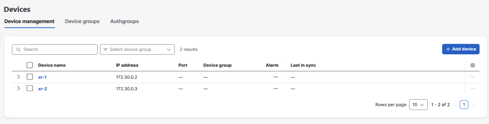
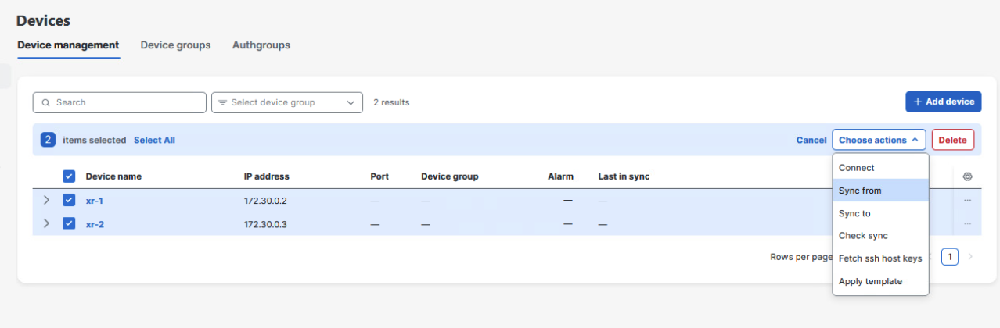
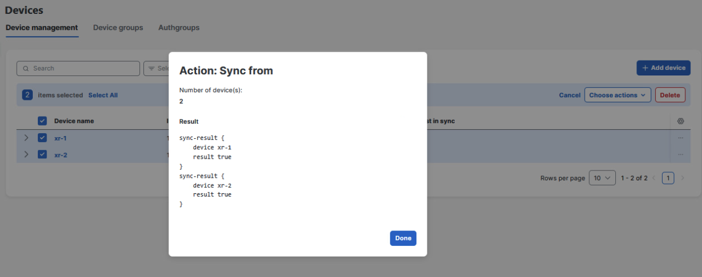

# Lab 3: Register XRd Routers

## Learning Objectives

By the end of this lab you will be able to:

- Verify XRd Docker containers are running on the lab host.
- Load device definitions into NSO and confirm devices appear in the Web UI.
- Run **sync-from** to populate the NSO CDB with device configuration.

## Time Budget

{{ time_budget(total=25, segments=[[10,"Verify containers"],[15,"Load devices & sync"]]) }}

## Prerequisites

- [ ] [Lab 2: Install NSO and NEDs](02-install-nso-neds.md) completed — NSO daemon is **started** and the **cisco-ios-xr** package shows in **ncs:packages**.
- [ ] You can open the NSO Web UI and run commands in a terminal on **linux-host**.

## Procedure

### Step 1: Verify XRd containers are running

Two XRd routers run as Docker containers on the same host. Confirm they are up:

```bash
docker ps
```

{{ expected_output(landmark="xr-1") }}

*Expected output:*

```text
CONTAINER ID   IMAGE                             COMMAND                CREATED      STATUS      NAMES
…              ios-xr/xrd-control-plane:…        "/usr/local/sbin/init" …         Up …        xr-2
…              ios-xr/xrd-control-plane:…        "/usr/local/sbin/init" …         Up …        xr-1
```

You should see **xr-1** and **xr-2** with the same `ios-xr/xrd-control-plane` image (tag may differ from the example). Other lab containers (for example **source** / **dest**) may appear — that is expected.

### Step 2: Load device definitions

A prepared XML template defines both routers. From the bundle directory (adjust if your site places `devices.xml` elsewhere):

```bash
cd ~/NSO-{{ nso_version }}-free/
ncs_load -l -m devices.xml
```

{{ expected_output(landmark="ncs_load") }}

*Expected output:*

```text

```

*(Empty stdout is normal when load succeeds.)*

| Flag | Meaning |
|------|---------|
| `-l` | Load operation |
| `-m` | Merge with existing configuration |

### Step 3: Verify devices in the Web UI

1. Open the NSO Web UI.
2. Click **Devices**.
3. Confirm **xr-1** and **xr-2** are listed.



### Step 4: Sync device configuration

The first action after adding devices is **sync-from** so the NSO CDB matches each device’s running configuration.

1. Select **all devices** (or each device in turn).
2. Execute **sync-from**.





!!! warning "If sync-from fails"
    Run **Fetch SSH Host Keys** first, then retry **sync-from**.

After a successful sync-from, NSO’s CDB holds the full running configuration of both routers.


!!! tip "Instructor"
    **Duration:** +5 min if Docker not up — `docker start` or VM issue. **FAQs:** `ncs_load` path — use absolute path to `devices.xml`. **Breaks:** SSH host key — Fetch keys before sync.


## Verification

Confirm both devices appear in NSO (source the environment as in Lab 2, then run one non-interactive CLI session):

```bash
source ~/NSO-INSTALL/ncsrc
echo "show devices list" | ncs_cli -u admin -C
```

{{ expected_output(landmark="xr-1") }}

*Expected output:*

```text
NAME  ADDRESS     DESCRIPTION  ADMIN-STATE  NODE  TAG
xr-1  …                        unlocked     …
xr-2  …                        unlocked     …
```

*(Addresses and columns follow your lab’s `devices.xml`.)*

## Common Errors

{{ common_errors_start() }}

{{ common_error(
  "docker ps does not list xr-1 and xr-2.",
  "Containers stopped, Docker not running, or wrong host session.",
  "On linux-host: `docker ps -a` and start containers per your lab guide; if broken, use Reset the Lab."
) }}

{{ common_error(
  "sync-from fails with authentication or host key errors.",
  "SSH keys not fetched or management IP mismatch in NSO vs device.",
  "Run Fetch SSH Host Keys, verify addresses in `devices.xml`, retry sync-from. See Reset the Lab if CDB is corrupt."
) }}

{{ common_errors_end() }}

If devices cannot be added or **sync-from** never succeeds after fetching SSH host keys, see **[Reset the Lab](reset-lab.md)** for snapshot restore versus re-loading device definitions.
